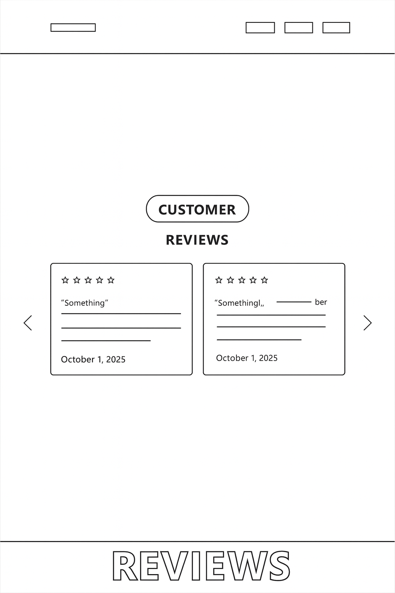
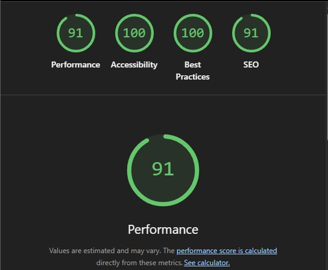

# Aurea Restaurant

[*Link to the live website*](https://aurea-project-53c55f91b857.herokuapp.com/)

# Project Overview

Aurea Italian Food is a modern, elegant web application designed to showcase the unique dining
experience of an authentic Italian restaurant. Built as part of my journey in full-stack web
development at Code Institute, the project highlights responsive design, smooth user interactions,
and clear navigation that reflect the welcoming, family-inspired atmosphere of Aurea.

Note: This project was initially started in a different repository without the Code Institute template.
That version is available here: https://github.com/Esteban-Jr/Aurea1.

## Features

### Homepage

*Design Rationale:*
- Clean hero section with restaurant branding and Italian-themed imagery.
- Bold headline and inviting introduction to communicate Aurea’s story.
- Prominent navigation menu for quick access to all key sections.
- Links to social media channels for extended user engagement.

### About Page

*Design Rationale:*
- Story of Aurea’s origins, emphasising passion for Italian cuisine and community.
- Philosophy section highlighting Authenticity, Quality, and Hospitality.
- Designed to reflect the values of a modern yet traditional Italian dining experience.

### Menu Page

*Design Rationale:*
- Card-based layout showcasing appetisers, entrées, and mains.
- High-quality food photography to entice users.
- Clear descriptions of each dish, including traditional Italian names.
- Consistent design with prices and details easy to scan.

### Gallery Page

*Design Rationale:*
- Grid layout featuring photographs of the restaurant’s interior.
- Showcases ambiance, seating arrangements, and décor.
- Provides potential visitors with a virtual tour of the space.

### Customer Reviews

*Design Rationale:*
- Displays user-generated reviews with ratings, comments, and author names.
- Simple card design for readability.
- Option to add new reviews for logged-in users.

### FAQ Page

*Design Rationale:*
Accordion-style drop downs answering common questions:
- Cuisine type
- Vegetarian/vegan options
- Table bookings
- Delivery/takeaway availability
- Opening hours
- Events and catering
- Parking availability
- Simple and responsive design for accessibility.

### Authentication (Login & Sign Up)

*Design Rationale:*
- User sign-up with fields for username, email, and secure password.
- Django authentication system with secure login/logout.
- Allows users to leave reviews and engage with the site.

## Key Features

- *Authentic Italian Atmosphere:*
  - A warm, inviting digital presence that mirrors the restaurant’s philosophy.

- *Dynamic Menu & Customer Reviews:*
  - Engaging menu presentation and a review system that builds trust with new visitors.

- *FAQ Integration:*
  - Practical, customer-first approach with quick answers to common questions.

- *Account Functionality:*
  - Users can create accounts, log in, and leave reviews.

- *Cloud Integration & Modern Tech Stack:*
  - Django for the backend, Bootstrap for responsive design, and Cloudinary for image hosting.

# User Experience

### Project Goals

- Showcase Aurea’s Dining Experience: Present dishes, ambiance, and philosophy clearly.
- Build Customer Trust: Feature testimonials and transparent FAQs.
- Encourage Bookings and Visits: Highlight menu items, atmosphere, and values.

#### Problems We Are Trying to Solve

1. Limited Online Presence - A professional and responsive restaurant website.
2. Lack of Transparency - FAQs, menu details, and reviews provide clarity.
3. Customer Engagement - Reviews, gallery, and sign-up create a sense of community.

## Technical Features

### Data and Security

- Environment variables for sensitive information (SECRET_KEY, database URL, Cloudinary).
- Django authentication for secure logins and password hashing.
- CSRF protection across forms.
- Reservations, reviews, and messages stored in a PostgreSQL database (SQLite in dev).

### Languages Used

HTML, CSS, JavaScript, Python

### Frameworks & Libraries

- Django (backend framework)
- Bootstrap 5 (frontend styling)
- django-allauth (authentication)
- pillow (image handling)
- psycopg2 (PostgreSQL compatibility)

### Databases

- SQLite3 (development)
- Heroku PostgreSQL (production)

##User Stories

As a First Time Visitor, I want to:

- Easily Navigate the Site so I can quickly find the menu, restaurant story, and contact details
without confusion.
- Experience the Atmosphere Virtually by viewing high-quality images in the gallery to see what
the restaurant looks like before visiting.
- Understand the Food Offerings by reading clear descriptions of menu items and seeing
authentic Italian dish names.
- Check Practical Information such as opening hours, parking availability, and whether
vegetarian/vegan options exist.
- Read Customer Reviews to learn from others’ dining experiences and decide if the restaurant
suits my expectations.
- Access a Responsive Website that works smoothly on both desktop and mobile devices.

As a Returning Visitor, I want to:

- View Updated Menus and Specials so I know if new dishes or seasonal offerings are available.
- Easily Make or Update Reservations with a streamlined booking process.
- Log In for a Personalized Experience to leave a review and engage with the community.
- Stay Informed with Fresh Content by checking new testimonials, FAQs, or gallery images that
show recent events.
- Experience Fast Loading Times that make browsing easy and enjoyable.
As a Registered User, I want to:
- Create an Account Easily so I can log in and share my own reviews.
- Submit and Manage Reviews to contribute feedback and edit or remove my comments if
needed.
- Save My Details Securely so I can log in quickly without re-entering all my information.

As a Superuser (Restaurant Manager), I want to:

- Oversee Reviews to approve or remove inappropriate comments.
- Monitor Reservations and User Activity to ensure smooth restaurant operations.
- Keep the Website Secure and Accessible so users trust the site and enjoy a consistent
experience.

## Deployment

### Local Deployment

1. *Clone the repository:*
bash
git clone https://github.com/Esteban-Jr/Aurea.git

2. *Create and activate a virtual environment:*
bash
python3 -m venv venv
source venv/bin/activate

3. *Install dependencies:*
bash
pip install -r requirements.txt

4. **Create a .env file in the project root (do not commit this file) with the following variables:**

SECRET_KEY=<your-secret-key>
DATABASE_URL=sqlite:///db.sqlite3
CLOUDINARY_URL=<your-cloudinary-url>
DEBUG=True

5. *Run migrations:*
bash
python manage.py migrate

6. *Start the server:*
bash
python manage.py runserver

Visit [http://127.0.0.1:8000](http://127.0.0.1:8000) to view the site locally.

---

### Heroku Deployment

Aurea is deployed on Heroku.
Follow these steps to deploy your own instance:

1. *Prerequisites:*
- A [Heroku](https://www.heroku.com/) account.
- A [Cloudinary](https://cloudinary.com/) account for image hosting.
- Git and [Heroku CLI](https://devcenter.heroku.com/articles/heroku-cli) installed locally.

2. *Prepare your project for deployment:*
Ensure the following files exist in your repository:
- requirements.txt – installable dependencies:
bash
pip freeze > requirements.txt

- runtime.txt – Python version (e.g.):

python-3.12.2

- Procfile – tells Heroku how to run the app:

web: gunicorn nova.wsgi

- Add these dependencies if not already included:

django-heroku
dj-database-url
gunicorn
psycopg2
cloudinary

3. *Push your code to GitHub* (Heroku will deploy from there).

4. *Create the Heroku app:*
bash
heroku login
heroku create your-app-name

5. *Add Heroku Postgres:*
bash
heroku addons:create heroku-postgresql:hobby-dev

6. *Set environment variables in Heroku:*
In the Heroku dashboard:
- Go to *Settings → Reveal Config Vars* and add:

SECRET_KEY=<your-secret-key>
DATABASE_URL=<provided by Heroku Postgres>
CLOUDINARY_URL=<your-cloudinary-url>
DISABLE_COLLECTSTATIC=1 # Temporarily for first deploy if static files cause errors
DEBUG=False
ALLOWED_HOSTS=your-app-name.herokuapp.com

7. *Deploy to Heroku:*
bash
git push heroku main

8. *Run migrations on Heroku:*
bash
heroku run python manage.py migrate

9. *(Optional) Create a superuser for Heroku:*
bash
heroku run python manage.py createsuperuser

10. *Collect static files (if disabled earlier):*
bash
heroku run python manage.py collectstatic

11. *Open your live app:*
bash
heroku open

Or visit:

https://your-app-name.herokuapp.com/

## Features Left to Implement

- Email confirmations for reviews/reservations.
- Personalized user dashboards with order/review history.
- Pre-order functionality for a faster in-restaurant experience.

## Accessibility
- High colour contrast for readability.
- Alt text included on all images.
- Keyboard navigation for all interactive elements.
- ARIA roles where necessary.

## Testing
- **HTML** — All HTML templates were tested using the [W3C Markup Validation Service](https://validator.w3.org/).  During HTML validation, a few structural issues were identified, including an instance of improper element nesting (div placed inside a heading tag) and an empty heading tag. These findings were reviewed, and updates will be made to ensure full compliance with semantic HTML standards and improve overall accessibility.

- **CSS** — All custom CSS was tested with the [W3C CSS Validator](https://jigsaw.w3.org/css-validator/).  
s

- **Lighthouse** used to evaluate performance, accessibility, SEO, and best practices.

---

### Automated Testing – Bookings

Automated tests were implemented using Django’s built-in `TestCase` framework to validate the core booking functionality of the application. These tests ensure that key booking-related features behave correctly and that invalid input is handled appropriately.

The following automated tests were created for the bookings feature:

- **Booking form rendering**: Confirms that the booking creation page loads correctly for authenticated users.
- **Successful booking creation**: Verifies that a booking with valid input (including a future date) is saved to the database and the user is redirected to the booking success page.
- **Edge case – past date booking**: Ensures that bookings using a past date are rejected and not saved to the database.

### Manual Functional Testing – Bookings

Manual functional testing was conducted by interacting with the application in a browser to verify that the bookings feature behaves correctly from a user perspective. This testing focused on validating access control, successful booking creation, and correct handling of invalid input.

The booking workflow was tested by logging in as a registered user, navigating to the booking creation page, submitting valid and invalid booking details, and observing the system’s responses.

| Test ID | Feature | Steps | Expected Result | Actual Result | Pass/Fail |
|--------|---------|-------|-----------------|---------------|-----------|
| MB01 | Booking page access | Attempt to access the booking page while logged out | User is redirected to the login page | Redirected to login page | Pass |
| MB02 | Create booking (valid input) | Login → navigate to booking page → select a future date → submit form | Booking is created and confirmation page is displayed | Booking created successfully and confirmation shown | Pass |
| MB03 | Create booking (past date – edge case) | Login → navigate to booking page → select a past date → submit form | Validation error displayed and booking is not saved | Error message displayed and booking not saved | Pass |

This manual testing confirms that the bookings feature functions correctly under normal conditions and that appropriate validation is in place to prevent invalid bookings from being created.

### Automated Testing – Accounts

Automated tests were implemented using Django’s built-in `TestCase` framework to validate authentication and account-related functionality. The tests verify that the login page renders correctly, that new users can sign up successfully, that valid credentials authenticate a user, and that invalid credentials are rejected (edge case). Logout behaviour was also tested to confirm that protected pages cannot be accessed after logging out.

### Manual Functional Testing – Accounts

Manual functional testing was conducted in a browser to verify the authentication workflow from a user perspective, including successful login, failed login attempts, and logout behaviour.

| Test ID | Feature | Steps | Expected Result | Actual Result | Pass/Fail |
|--------|---------|-------|-----------------|---------------|-----------|
| MA01 | Login (valid) | Go to Login → enter correct username/password → submit | User is logged in and redirected | Logged in and redirected | Pass |
| MA02 | Login (invalid – edge case) | Go to Login → enter correct username + wrong password → submit | Error shown, user not logged in | Error shown, not logged in | Pass |
| MA03 | Logout | While logged in → click logout → confirm/logout (POST) | User logged out and returned to home | Logged out and redirected | Pass |

### Automated Testing – Pages

Automated tests were implemented using Django’s `TestCase` framework to verify that key site pages render correctly and use the expected templates. Tests cover the home, about, menu, FAQ, and gallery pages. An edge case was also tested by requesting an invalid URL to confirm the application returns a 404 response.

### Manual Functional Testing – Pages

Manual functional testing was conducted in a browser to ensure that all static pages load correctly and that site navigation functions as expected across the application.

| Test ID | Feature | Steps | Expected Result | Actual Result | Pass/Fail |
|--------|---------|-------|-----------------|---------------|-----------|
| MP01 | Home page | Navigate to the home page | Home page loads successfully | Home page loaded successfully | Pass |
| MP02 | About page | Click the About link in the navigation bar | About page loads successfully | About page loaded successfully | Pass |
| MP03 | Menu page | Click the Menu link in the navigation bar | Menu page loads successfully | Menu page loaded successfully | Pass |
| MP04 | FAQ page | Click the FAQ link in the navigation bar | FAQ page loads successfully | FAQ page loaded successfully | Pass |
| MP05 | Gallery page | Click the Gallery link in the navigation bar | Gallery page loads successfully | Gallery page loaded successfully | Pass |
| MP06 | Invalid URL (edge case) | Enter a non-existent URL in the browser | 404 error page displayed | 404 error page displayed | Pass |

### Automated Testing – Reviews

Automated tests were implemented using Django’s `TestCase` framework to validate the reviews feature. The test suite confirms that the reviews list page renders correctly, that only authenticated users can access the add review page (edge case: unauthenticated users are redirected), and that logged-in users can successfully create, edit, and delete their own reviews.

### Manual Functional Testing – Reviews

Manual functional testing was conducted in a browser to verify review submission and review management from a user perspective.

| Test ID | Feature | Steps | Expected Result | Actual Result | Pass/Fail |
|--------|---------|-------|-----------------|---------------|-----------|
| MR01 | View reviews | Navigate to the Reviews page | Reviews are displayed in correct order | Reviews displayed correctly | Pass |
| MR02 | Add review (valid) | Login → go to Add Review → enter comment and select rating → submit | Review is saved and shown in the list | Review saved and shown in list | Pass |
| MR03 | Add review (logged out – edge case) | Logout → attempt to access Add Review page | User is redirected to login page | Redirected to login page | Pass |
| MR04 | Edit review | Login → edit own review → submit changes | Review is updated successfully | Review updated successfully | Pass |
| MR05 | Delete review | Login → delete own review → confirm deletion | Review is removed from the list | Review removed successfully | Pass |

---

### Responsiveness Testing

The site’s responsiveness was tested using:

- *Chrome DevTools Device Toolbar* for multiple screen sizes.
- Physical devices: iPhone, iPad, and Android smartphones.

All pages adapt correctly to different screen sizes without layout issues.

—

### Known Issues

- Occasionally, Cloudinary images may take a moment to load on very slow connections. This is
due to network speed rather than a site bug.
- No other significant issues were found during testing.

## Credits & Acknowledgements

- Code Institute for guidance and structure.
- Code Institute Slack community for peer support.
- Django, Bootstrap, and Cloudinary documentation for technical reference.
- Unsplash and AI-generated images for placeholders.
- Special thanks to friends and family who provided feedback on usability.